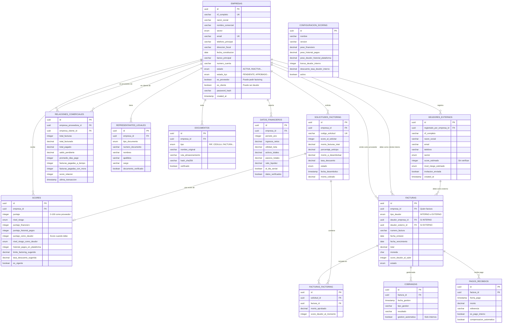

# KINIA - Especificación Técnica Completa
## Plataforma Fintech B2B para Factoring y Cobranza (Venezuela)

> **Versión:** 2.0  
> **Última actualización:** Febrero 2025  
> **Audiencia:** IAs autómatas, desarrolladores, arquitectos de software  
> **Stack:** Java Spring Boot + Thymeleaf + PostgreSQL

---

## Tabla de Contenidos

1. [Resumen Ejecutivo](#1-resumen-ejecutivo)
2. [Modelo de Negocio](#2-modelo-de-negocio)
3. [Concepto de Ecosistema Cerrado](#3-concepto-de-ecosistema-cerrado)
4. [Actores del Sistema](#4-actores-del-sistema)
5. [Flujos de Negocio](#5-flujos-de-negocio)
6. [Reglas de Negocio](#6-reglas-de-negocio)
7. [Motor de Scoring](#7-motor-de-scoring)
8. [Modelo de Datos](#8-modelo-de-datos)
9. [Diagrama Entidad-Relación](#9-diagrama-entidad-relación)
10. [Schema SQL Completo](#10-schema-sql-completo)
11. [Stack Tecnológico](#11-stack-tecnológico)
12. [Requisitos del MVP](#12-requisitos-del-mvp)
13. [Consideraciones de Seguridad](#13-consideraciones-de-seguridad)
14. [Contexto Regulatorio Venezuela](#14-contexto-regulatorio-venezuela)

---

## 1. Resumen Ejecutivo

### ¿Qué es Kinia?

Kinia es una plataforma fintech venezolana que permite a PYMES obtener **liquidez inmediata** mediante:

1. **Factoring:** Anticipo de facturas por cobrar (80-90% del valor) a cambio de una comisión.
2. **Cobranza:** Gestión y recuperación de pagos pendientes.

### Problema que Resuelve

```
SITUACIÓN TÍPICA DE UNA PYME:

┌─────────────────────────────────────────────────────────────────┐
│  "Vendí $50,000 en mercancía a Empresas Polar"                 │
│  "Me pagarán en 90 días"                                        │
│  "Pero necesito pagar nómina y proveedores HOY"                │
│  "No tengo liquidez aunque tengo dinero comprometido"          │
└─────────────────────────────────────────────────────────────────┘

SOLUCIÓN KINIA:

┌─────────────────────────────────────────────────────────────────┐
│  1. Subes tu factura de $50,000 a Kinia                        │
│  2. Kinia evalúa tu score (75/100) y el del deudor (90/100)    │
│  3. Kinia te ofrece $42,500 HOY (85% - comisión 5%)            │
│  4. Aceptas y recibes el dinero en tu cuenta                   │
│  5. Kinia cobra a Polar en 90 días                             │
│  6. Kinia recupera su inversión + ganancia                     │
└─────────────────────────────────────────────────────────────────┘
```

### Propuesta de Valor

| Para PYMES (Proveedores) | Para Kinia |
|--------------------------|------------|
| Liquidez inmediata | Comisión por factoring (3-18%) |
| Sin endeudarse con bancos | Data de comportamiento comercial |
| Proceso 100% digital | Efecto de red (ecosistema) |
| Mejores tasas si sus clientes están en Kinia | Cobranza con información privilegiada |

---

## 2. Modelo de Negocio

### Flujo de Ingresos

```
INGRESOS KINIA = Σ (Monto Factura × Tasa Descuento) + Comisiones Fijas

Donde:
- Tasa Descuento: 3% a 18% según riesgo
- Comisiones Fijas: Por gestión, cobranza, etc.
```

### Ejemplo Numérico

```
Factura:                    $10,000
Score del proveedor:        75/100 (Bajo riesgo)
Score del deudor:           85/100 (Muy bajo riesgo)
Tasa aplicada:              5%
Porcentaje de anticipo:     85%

CÁLCULO:
├── Monto anticipo:         $10,000 × 85% = $8,500
├── Comisión Kinia:         $10,000 × 5%  = $500
├── Monto a desembolsar:    $8,500 - $500 = $8,000
└── Monto retenido:         $10,000 - $8,500 = $1,500 (se devuelve al cobrar)

RESULTADO:
- Proveedor recibe HOY:     $8,000
- Proveedor recibe al cobrar: $1,500
- Kinia gana:               $500
```

---

## 3. Concepto de Ecosistema Cerrado

### Principio Fundamental

> **Los clientes deudores pueden ser otras empresas registradas en Kinia.**

Este concepto transforma a Kinia de una simple plataforma de factoring a una **red de confianza comercial**.

### Tipos de Deudores

```
┌─────────────────────────────────────────────────────────────────┐
│                      FACTURAS EN KINIA                          │
├─────────────────────────────────────────────────────────────────┤
│                                                                 │
│  DEUDOR INTERNO                    DEUDOR EXTERNO              │
│  (Empresa registrada en Kinia)     (NO está en Kinia)          │
│                                                                 │
│  ✓ Score REAL verificado           ✗ Score ESTIMADO            │
│  ✓ Datos financieros reales        ✗ Sin datos verificados     │
│  ✓ Historial de pagos EN Kinia     ✗ Solo referencias          │
│  ✓ Cobranza automática posible     ✗ Cobranza manual           │
│  ✓ Compensación de saldos          ✗ No aplica                 │
│  ✓ MEJORES TASAS                   ✗ Tasas más altas           │
│                                                                 │
└─────────────────────────────────────────────────────────────────┘
```

### Beneficios del Ecosistema Cerrado

```
┌─────────────────────────────────────────────────────────────────┐
│                    EFECTO DE RED                                │
│                                                                 │
│     Más empresas registradas                                    │
│              ↓                                                  │
│     Más transacciones entre ellas                              │
│              ↓                                                  │
│     Mejor data de comportamiento                               │
│              ↓                                                  │
│     Scoring más preciso                                        │
│              ↓                                                  │
│     Menores tasas para todos                                   │
│              ↓                                                  │
│     MÁS empresas quieren registrarse                           │
│              ↓                                                  │
│     🔄 CICLO VIRTUOSO                                          │
│                                                                 │
└─────────────────────────────────────────────────────────────────┘
```

### Incentivos para Deudores Internos

| Configuración | Valor |
|---------------|-------|
| `bonus_deudor_interno` | +10 puntos al score |
| `descuento_tasa_deudor_interno` | -2% en tasa de descuento |

**Ejemplo:**
- Factura a deudor EXTERNO con score 70 → Tasa 7.5%
- Factura a deudor INTERNO con score 70 → Score efectivo 80, Tasa 3.5%

---

## 4. Actores del Sistema

### 4.1 Empresa (Usuario Principal)

Puede tener DOS roles simultáneos:

```
┌─────────────────────────────────────────────────────────────────┐
│                        EMPRESA EN KINIA                         │
├─────────────────────────────────────────────────────────────────┤
│                                                                 │
│  ROL: PROVEEDOR                    ROL: CLIENTE                │
│  (es_proveedor = true)             (es_cliente = true)         │
│                                                                 │
│  • Sube facturas                   • Aparece como deudor       │
│  • Solicita factoring              • Recibe cobranzas          │
│  • Recibe anticipos                • Su score afecta a otros   │
│  • Tiene score como proveedor      • Tiene score como deudor   │
│                                                                 │
└─────────────────────────────────────────────────────────────────┘
```

### 4.2 Deudor Externo

Empresa que NO está registrada en Kinia pero debe facturas a empresas que SÍ lo están.

```
CARACTERÍSTICAS:
- Registrado por una empresa del ecosistema
- Score ESTIMADO (no verificado)
- Puede recibir INVITACIÓN para registrarse
- Si se registra, se convierte en Deudor Interno (mejor para todos)
```

### 4.3 Administrador Kinia (Futuro)

```
FUNCIONES:
- Revisar KYC de nuevas empresas
- Aprobar/rechazar solicitudes de factoring
- Ajustar scores manualmente
- Gestionar cobranzas complejas
- Configurar parámetros del sistema
```

---

## 5. Flujos de Negocio

### 5.1 Flujo de Registro y KYC

```
┌─────────────────────────────────────────────────────────────────┐
│                    FLUJO DE REGISTRO                            │
└─────────────────────────────────────────────────────────────────┘

    ┌──────────────┐
    │   INICIO     │
    └──────┬───────┘
           │
           ▼
    ┌──────────────┐
    │  Formulario  │  • RIF (J-12345678-9)
    │  de Registro │  • Razón social
    │              │  • Email, contraseña
    │              │  • Datos representante legal
    └──────┬───────┘
           │
           ▼
    ┌──────────────┐
    │    Upload    │  • Documento RIF
    │  Documentos  │  • Cédula representante
    │              │  • Registro mercantil (opcional)
    └──────┬───────┘
           │
           ▼
    ┌──────────────┐
    │  Validación  │  • Formato RIF correcto
    │   Inicial    │  • Email único
    │              │  • Documentos legibles
    └──────┬───────┘
           │
           ▼
    ┌──────────────┐
    │   Estado:    │
    │  PENDIENTE   │──────────────────────┐
    └──────┬───────┘                      │
           │                              │
           ▼                              ▼
    ┌──────────────┐              ┌──────────────┐
    │  Revisión    │              │   Email de   │
    │  KYC (auto   │              │ verificación │
    │  o manual)   │              │   enviado    │
    └──────┬───────┘              └──────────────┘
           │
     ┌─────┴─────┐
     │           │
     ▼           ▼
┌─────────┐ ┌─────────┐
│APROBADO │ │RECHAZADO│
└────┬────┘ └────┬────┘
     │           │
     ▼           ▼
┌─────────┐ ┌─────────┐
│ Acceso  │ │Notifica │
│ Dashboard│ │ razón  │
└─────────┘ └─────────┘
```

### 5.2 Flujo de Factoring Completo

```
┌─────────────────────────────────────────────────────────────────┐
│                    FLUJO DE FACTORING                           │
└─────────────────────────────────────────────────────────────────┘

FASE 1: SUBIDA DE FACTURA
─────────────────────────
    ┌──────────────┐
    │  Empresa     │
    │  sube factura│
    └──────┬───────┘
           │
           ▼
    ┌──────────────┐     ┌─────────────────────────────────┐
    │ ¿El deudor   │ SÍ  │  Tipo: INTERNO                  │
    │ está en      │────▶│  deudor_empresa_id = UUID       │
    │ Kinia?       │     │  Score: REAL (verificado)       │
    └──────┬───────┘     └─────────────────────────────────┘
           │ NO
           ▼
    ┌──────────────┐     ┌─────────────────────────────────┐
    │ ¿Existe como │ SÍ  │  Tipo: EXTERNO                  │
    │ deudor       │────▶│  deudor_externo_id = UUID       │
    │ externo?     │     │  Score: ESTIMADO                │
    └──────┬───────┘     └─────────────────────────────────┘
           │ NO
           ▼
    ┌──────────────┐
    │ Crear nuevo  │
    │ deudor       │
    │ externo      │
    └──────┬───────┘
           │
           ▼
    ┌──────────────┐
    │  Factura     │
    │  Estado:     │
    │  PENDIENTE   │
    └──────────────┘


FASE 2: SOLICITUD DE FACTORING
──────────────────────────────
    ┌──────────────┐
    │  Empresa     │
    │  selecciona  │
    │  facturas    │
    └──────┬───────┘
           │
           ▼
    ┌──────────────┐
    │  Sistema     │
    │  calcula:    │
    │              │
    │  • Score     │
    │    proveedor │
    │  • Score     │
    │    deudor(es)│
    │  • Tasa      │
    │  • % anticipo│
    │  • Monto     │
    └──────┬───────┘
           │
           ▼
    ┌──────────────┐
    │   OFERTA     │
    │              │
    │ "Te ofrecemos│
    │  $8,000 por  │
    │  tus facturas│
    │  de $10,000" │
    │              │
    │ [ACEPTAR]    │
    │ [RECHAZAR]   │
    └──────┬───────┘
           │
     ┌─────┴─────┐
     │           │
     ▼           ▼
┌─────────┐ ┌─────────┐
│ ACEPTA  │ │ RECHAZA │
└────┬────┘ └────┬────┘
     │           │
     ▼           ▼
┌─────────┐ ┌─────────┐
│Solicitud│ │   FIN   │
│ ENVIADA │ └─────────┘
└────┬────┘
     │
     ▼

FASE 3: APROBACIÓN Y DESEMBOLSO
───────────────────────────────
    ┌──────────────┐
    │  Revisión    │
    │  (auto/manual)│
    └──────┬───────┘
           │
     ┌─────┴─────┐
     │           │
     ▼           ▼
┌─────────┐ ┌─────────┐
│APROBADA │ │RECHAZADA│
└────┬────┘ └─────────┘
     │
     ▼
┌─────────────┐
│ DESEMBOLSO  │
│             │
│ Transferencia│
│ a cuenta de │
│ la empresa  │
└──────┬──────┘
       │
       ▼
┌─────────────┐
│  Solicitud  │
│ DESEMBOLSADA│
│             │
│ Facturas:   │
│ ANTICIPADAS │
└──────┬──────┘
       │
       ▼

FASE 4: COBRANZA
────────────────
┌─────────────────────────────────────────────────────────────────┐
│                                                                 │
│  ┌─────────────┐         ┌─────────────┐                       │
│  │   Deudor    │         │   Deudor    │                       │
│  │   INTERNO   │         │   EXTERNO   │                       │
│  └──────┬──────┘         └──────┬──────┘                       │
│         │                       │                               │
│         ▼                       ▼                               │
│  ┌─────────────┐         ┌─────────────┐                       │
│  │  Cobranza   │         │  Cobranza   │                       │
│  │ AUTOMÁTICA  │         │   MANUAL    │                       │
│  │             │         │             │                       │
│  │ • Notificación│       │ • Llamadas  │                       │
│  │   en plataforma│      │ • Emails    │                       │
│  │ • Compensación│       │ • Visitas   │                       │
│  │   de saldos  │        │             │                       │
│  └──────┬──────┘         └──────┬──────┘                       │
│         │                       │                               │
│         └───────────┬───────────┘                              │
│                     │                                           │
│                     ▼                                           │
│              ┌─────────────┐                                   │
│              │    PAGO     │                                   │
│              │  RECIBIDO   │                                   │
│              └──────┬──────┘                                   │
│                     │                                           │
│                     ▼                                           │
│              ┌─────────────┐                                   │
│              │  Solicitud  │                                   │
│              │  LIQUIDADA  │                                   │
│              │             │                                   │
│              │ • Liberar   │                                   │
│              │   retenido  │                                   │
│              │ • Actualizar│                                   │
│              │   relación  │                                   │
│              │   comercial │                                   │
│              └─────────────┘                                   │
│                                                                 │
└─────────────────────────────────────────────────────────────────┘
```

### 5.3 Flujo de Conversión: Externo → Interno

```
┌─────────────────────────────────────────────────────────────────┐
│           CONVERSIÓN DE DEUDOR EXTERNO A INTERNO                │
└─────────────────────────────────────────────────────────────────┘

    ┌──────────────┐
    │   Deudor     │
    │   Externo    │
    │   en sistema │
    └──────┬───────┘
           │
           ▼
    ┌──────────────┐
    │   Sistema    │
    │   envía      │
    │  invitación  │
    │   por email  │
    └──────┬───────┘
           │
           ▼
    ┌──────────────┐
    │  "Te invitan │
    │  a Kinia.    │
    │  Empresas te │
    │  facturan y  │
    │  puedes      │
    │  obtener     │
    │  mejores     │
    │  condiciones"│
    └──────┬───────┘
           │
     ┌─────┴─────┐
     │           │
     ▼           ▼
┌─────────┐ ┌─────────┐
│ ACEPTA  │ │ IGNORA  │
└────┬────┘ └─────────┘
     │
     ▼
┌─────────────┐
│  Completa   │
│  registro   │
│  normal     │
└──────┬──────┘
       │
       ▼
┌─────────────┐
│  MIGRACIÓN  │
│             │
│ • Se vinculan│
│   facturas  │
│   existentes│
│ • Score pasa│
│   de ESTIMADO│
│   a REAL    │
│ • Mejoran   │
│   tasas para│
│   proveedores│
└─────────────┘
```

---

## 6. Reglas de Negocio

### 6.1 Reglas de Validación

```yaml
RIF_VENEZOLANO:
  formato: "[J|G|V|E|P|C]-[0-9]{8,9}-[0-9]"
  ejemplos_válidos:
    - "J-12345678-9"
    - "V-12345678-0"
  validación_dígito_verificador: true  # Algoritmo módulo 11

EMAIL:
  único_por_empresa: true
  verificación_requerida: true  # Para MVP puede ser opcional
  
CONTRASEÑA:
  longitud_mínima: 8
  requiere_mayúscula: true
  requiere_número: true
  requiere_especial: true

FACTURA:
  fecha_emisión: <= HOY
  fecha_vencimiento: > fecha_emisión
  fecha_vencimiento: <= HOY + 180 días  # Máximo 6 meses
  monto_mínimo: $100 USD equivalente
  no_puede_facturarse_a_sí_mismo: true
```

### 6.2 Reglas de Estado

```yaml
EMPRESA.estado_kyc:
  transiciones_permitidas:
    PENDIENTE: [EN_REVISION, RECHAZADO]
    EN_REVISION: [APROBADO, RECHAZADO, REQUIERE_INFO]
    REQUIERE_INFO: [EN_REVISION, RECHAZADO]
    APROBADO: [SUSPENDIDO]  # Solo admin
    RECHAZADO: [PENDIENTE]  # Si reaplica

FACTURA.estado:
  transiciones_permitidas:
    PENDIENTE: [EN_EVALUACION, RECHAZADA]
    EN_EVALUACION: [APROBADA, RECHAZADA]
    APROBADA: [ANTICIPADA]
    ANTICIPADA: [EN_COBRANZA]
    EN_COBRANZA: [COBRADA, VENCIDA]
    VENCIDA: [COBRADA, INCOBRABLE]

SOLICITUD_FACTORING.estado:
  transiciones_permitidas:
    BORRADOR: [ENVIADA, CANCELADA]
    ENVIADA: [EN_REVISION, CANCELADA]
    EN_REVISION: [APROBADA, RECHAZADA]
    APROBADA: [DESEMBOLSADA]
    DESEMBOLSADA: [EN_COBRANZA]
    EN_COBRANZA: [LIQUIDADA]
```

### 6.3 Reglas de Negocio Core

```yaml
FACTORING:
  # Una factura solo puede estar en UNA solicitud activa
  factura_única_por_solicitud_activa: true
  
  # Score mínimo para solicitar factoring
  score_mínimo_proveedor: 25
  
  # Score mínimo del deudor para aprobar factura
  score_mínimo_deudor: 20
  
  # Límite de factoring no puede exceder
  límite_máximo: menor(límite_sugerido, patrimonio × 2)

DEUDOR_INTERNO:
  # Bonus al score cuando el deudor está en Kinia
  bonus_score: 10
  
  # Descuento en tasa
  descuento_tasa: 2.0%
  
  # Permite cobranza automática
  cobranza_automática: true
  
  # Permite compensación de saldos
  compensación_permitida: true

RELACIONES_COMERCIALES:
  # Se actualiza automáticamente con cada factura
  actualización_automática: true
  
  # Score de relación basado en:
  factores:
    - porcentaje_pagos_a_tiempo
    - promedio_días_mora
    - volumen_transacciones
    - antigüedad_relación
```

### 6.4 Reglas de Cálculo

```yaml
MONTO_ANTICIPO:
  fórmula: monto_facturas × porcentaje_anticipo
  
COMISIÓN:
  fórmula: monto_facturas × tasa_descuento + comisión_fija
  
MONTO_A_DESEMBOLSAR:
  fórmula: monto_anticipo - comisión
  
MONTO_RETENIDO:
  fórmula: monto_facturas - monto_anticipo
  nota: "Se devuelve al proveedor cuando se cobra la factura"

DÍAS_MORA:
  fórmula: MAX(0, fecha_pago - fecha_vencimiento)
  
PORCENTAJE_PAGO_A_TIEMPO:
  fórmula: (facturas_a_tiempo / total_facturas) × 100
```

---

## 7. Motor de Scoring

### 7.1 Score como Proveedor (para solicitar factoring)

```yaml
COMPONENTES:
  financiero:
    peso: 30%
    factores:
      - ratio_liquidez (activo_corriente / pasivo_corriente)
      - ratio_endeudamiento (pasivo / activo)
      - margen_neto (utilidad / ingresos)
      - flujo_caja_positivo
    
  historial_pagos:
    peso: 25%
    factores:
      - porcentaje_pagos_a_tiempo
      - promedio_días_mora
      - deudas_actuales_vencidas
    
  antigüedad:
    peso: 15%
    escala:
      - "< 1 año": 40 puntos
      - "1-3 años": 60 puntos
      - "3-5 años": 80 puntos
      - "> 5 años": 100 puntos
    
  sector:
    peso: 10%
    riesgo_por_sector:
      TECNOLOGIA: bajo
      ALIMENTOS: bajo
      MANUFACTURA: medio
      CONSTRUCCION: alto
      # etc.
    
  cumplimiento:
    peso: 10%
    factores:
      - al_día_seniat
      - al_día_ivss
      - al_día_faov
      - al_día_inces
    
  documentación:
    peso: 10%
    factores:
      - documentos_completos
      - documentos_verificados
      - documentos_vigentes

CÁLCULO:
  puntaje_final = Σ (puntaje_componente × peso_componente)
  rango: 0-100
```

### 7.2 Score como Deudor (cuando otra empresa le factura)

```yaml
COMPONENTES:
  historial_plataforma:
    peso: 40%
    factores:
      - pagos_realizados_en_kinia
      - promedio_días_pago_en_kinia
      - facturas_vencidas_actuales
    nota: "Este es el diferenciador clave vs deudores externos"
    
  financiero:
    peso: 30%
    factores:
      - mismos que score proveedor
    
  antigüedad:
    peso: 15%
    
  referencias_externas:
    peso: 15%
    factores:
      - referencias_bancarias
      - referencias_comerciales

BONUS_DEUDOR_INTERNO:
  valor: +10 puntos
  condición: empresa registrada y KYC aprobado
```

### 7.3 Niveles de Riesgo y Tasas

```yaml
NIVELES:
  MUY_BAJO:
    rango_score: 80-100
    tasa_base: 3.5%
    porcentaje_anticipo: 90%
    
  BAJO:
    rango_score: 65-79
    tasa_base: 5.0%
    porcentaje_anticipo: 85%
    
  MEDIO:
    rango_score: 50-64
    tasa_base: 7.5%
    porcentaje_anticipo: 80%
    
  ALTO:
    rango_score: 35-49
    tasa_base: 12.0%
    porcentaje_anticipo: 70%
    
  MUY_ALTO:
    rango_score: 0-34
    tasa_base: 18.0%
    porcentaje_anticipo: 60%

AJUSTES:
  deudor_interno: tasa - 2%
  múltiples_facturas_mismo_deudor: tasa - 0.5%
  cliente_recurrente: tasa - 1%
```

### 7.4 Pseudocódigo del Motor

```java
public class ScoringService {
    
    public Score calcularScore(Empresa empresa) {
        // 1. Obtener datos
        DatosFinancieros datos = obtenerUltimosDatosFinancieros(empresa);
        List<HistorialPago> historial = obtenerHistorialPagos(empresa);
        List<Documento> documentos = obtenerDocumentos(empresa);
        ConfiguracionScoring config = obtenerConfiguracionActiva();
        
        // 2. Calcular componentes
        int puntajeFinanciero = calcularPuntajeFinanciero(datos);
        int puntajeHistorial = calcularPuntajeHistorial(historial);
        int puntajeAntiguedad = calcularPuntajeAntiguedad(empresa.getFechaConstitucion());
        int puntajeSector = calcularPuntajeSector(empresa.getSector());
        int puntajeCumplimiento = calcularPuntajeCumplimiento(datos);
        int puntajeDocumentacion = calcularPuntajeDocumentacion(documentos);
        
        // 3. Calcular score como PROVEEDOR
        int scoreProveedor = 
            (puntajeFinanciero * config.getPesoFinanciero() +
             puntajeHistorial * config.getPesoHistorial() +
             puntajeAntiguedad * config.getPesoAntiguedad() +
             puntajeSector * config.getPesoSector() +
             puntajeCumplimiento * config.getPesoCumplimiento() +
             puntajeDocumentacion * config.getPesoDocumentacion()) / 100;
        
        // 4. Calcular score como DEUDOR
        int historialEnPlataforma = calcularHistorialEnPlataforma(empresa);
        int scoreDeudor = 
            (historialEnPlataforma * config.getPesoDeudorHistorial() +
             puntajeFinanciero * config.getPesoDeudorFinanciero() +
             puntajeAntiguedad * config.getPesoDeudorAntiguedad() +
             calcularReferenciasExternas(empresa) * config.getPesoDeudorExterno()) / 100;
        
        // 5. Determinar nivel de riesgo y tasas
        NivelRiesgo nivel = determinarNivelRiesgo(scoreProveedor, config);
        BigDecimal tasa = obtenerTasaBase(nivel, config);
        BigDecimal porcentajeAnticipo = obtenerPorcentajeAnticipo(nivel, config);
        BigDecimal limite = calcularLimiteFactoring(empresa, datos, scoreProveedor);
        
        // 6. Construir resultado
        return Score.builder()
            .empresaId(empresa.getId())
            .puntaje(scoreProveedor)
            .nivelRiesgo(nivel)
            .puntajeComoDeudor(scoreDeudor)
            .nivelRiesgoComoDeudor(determinarNivelRiesgo(scoreDeudor, config))
            .limiteFactoringSugerido(limite)
            .tasaDescuentoSugerida(tasa)
            .esVigente(true)
            .build();
    }
    
    private int calcularHistorialEnPlataforma(Empresa empresa) {
        // Buscar todas las facturas donde esta empresa es DEUDORA
        List<Factura> facturasComoDeudor = facturaRepository
            .findByDeudorEmpresaId(empresa.getId());
        
        if (facturasComoDeudor.isEmpty()) {
            return 50; // Score neutro si no hay historial
        }
        
        long pagadasATiempo = facturasComoDeudor.stream()
            .filter(f -> f.getEstado() == EstadoFactura.COBRADA)
            .filter(f -> calcularDiasMora(f) == 0)
            .count();
        
        double porcentaje = (double) pagadasATiempo / facturasComoDeudor.size();
        
        return (int) (porcentaje * 100);
    }
}
```

---

## 8. Modelo de Datos

### 8.1 Entidades Principales

| Entidad | Descripción | Rol en el Sistema |
|---------|-------------|-------------------|
| `empresas` | Comercios registrados | Pueden ser proveedores Y/O clientes |
| `deudores_externos` | Empresas NO registradas | Solo aparecen como deudores |
| `relaciones_comerciales` | Historial entre empresas | Tracking del ecosistema |
| `representantes_legales` | Personas físicas | KYC y cumplimiento |
| `documentos` | Archivos subidos | Verificación y evidencia |
| `datos_financieros` | Info financiera | Input para scoring |
| `scores` | Resultados scoring | Determina tasas y límites |
| `facturas` | Facturas por cobrar | Objeto del factoring |
| `solicitudes_factoring` | Pedidos de anticipo | Transacción principal |
| `cobranzas` | Gestiones de cobro | Seguimiento de pagos |
| `pagos_recibidos` | Pagos entrantes | Cierre del ciclo |

### 8.2 Relaciones Clave

```
EMPRESAS (1) ────────────────── (N) REPRESENTANTES_LEGALES
EMPRESAS (1) ────────────────── (N) DOCUMENTOS
EMPRESAS (1) ────────────────── (N) DATOS_FINANCIEROS
EMPRESAS (1) ────────────────── (N) SCORES
EMPRESAS (1) ────────────────── (N) FACTURAS (como proveedor)
EMPRESAS (1) ────────────────── (N) FACTURAS (como deudor interno)
EMPRESAS (1) ────────────────── (N) SOLICITUDES_FACTORING
EMPRESAS (1) ────────────────── (N) DEUDORES_EXTERNOS (registrados por)
EMPRESAS (1) ────────────────── (N) RELACIONES_COMERCIALES (como proveedor)
EMPRESAS (1) ────────────────── (N) RELACIONES_COMERCIALES (como cliente)

DEUDORES_EXTERNOS (1) ───────── (N) FACTURAS (como deudor externo)

FACTURAS (N) ────────────────── (N) SOLICITUDES_FACTORING (via facturas_factoring)
FACTURAS (1) ────────────────── (N) COBRANZAS
FACTURAS (1) ────────────────── (N) PAGOS_RECIBIDOS
```

---

## 9. Diagrama Entidad-Relación



---

## 10. Schema SQL Completo

El schema SQL completo está disponible en el archivo adjunto: `kinia_schema_v2.sql`

### Tablas Principales

```sql
-- Listado de tablas en orden de dependencia
1.  empresas                    -- Núcleo del sistema
2.  deudores_externos           -- Deudores no registrados
3.  relaciones_comerciales      -- Historial entre empresas
4.  representantes_legales      -- KYC
5.  documentos                  -- Archivos
6.  datos_financieros           -- Input scoring
7.  scores                      -- Resultados scoring
8.  facturas                    -- Objeto del factoring
9.  solicitudes_factoring       -- Transacciones
10. facturas_factoring          -- Relación N:N
11. cobranzas                   -- Gestión de cobros
12. pagos_recibidos             -- Pagos entrantes
13. configuracion_scoring       -- Parámetros
14. auditoria_acciones          -- Logs
```

### Constraints Críticos

```sql
-- Una factura debe tener UN tipo de deudor (no ambos)
CONSTRAINT chk_deudor_exclusivo CHECK (
    (tipo_deudor = 'INTERNO' AND deudor_empresa_id IS NOT NULL AND deudor_externo_id IS NULL) OR
    (tipo_deudor = 'EXTERNO' AND deudor_empresa_id IS NULL AND deudor_externo_id IS NOT NULL)
)

-- No puede facturarse a sí mismo
CONSTRAINT chk_no_auto_factura CHECK (empresa_id != deudor_empresa_id)

-- Pesos de scoring deben sumar 100
CONSTRAINT chk_pesos_proveedor CHECK (
    peso_financiero + peso_historial_pagos + peso_antiguedad + 
    peso_sector + peso_cumplimiento + peso_documentacion = 100
)
```

### Triggers Automáticos

```sql
-- Actualizar relación comercial al crear factura
CREATE TRIGGER trigger_actualizar_relacion 
    AFTER INSERT ON facturas
    FOR EACH ROW EXECUTE FUNCTION actualizar_relacion_comercial();

-- Actualizar estadísticas al recibir pago
CREATE TRIGGER trigger_actualizar_relacion_pago 
    AFTER INSERT ON pagos_recibidos
    FOR EACH ROW EXECUTE FUNCTION actualizar_relacion_pago();

-- Invalidar scores anteriores
CREATE TRIGGER invalidar_scores_previos 
    AFTER INSERT ON scores
    FOR EACH ROW EXECUTE FUNCTION invalidar_scores_anteriores();

-- Generar código de solicitud automático
CREATE TRIGGER generar_codigo_factoring 
    BEFORE INSERT ON solicitudes_factoring
    FOR EACH ROW EXECUTE FUNCTION generar_codigo_solicitud();
```

### Vistas Útiles

```sql
-- Deudores unificados (internos + externos)
CREATE VIEW v_deudores_unificados AS ...

-- Empresas con su score vigente
CREATE VIEW v_empresas_con_score AS ...

-- Facturas con info completa del deudor
CREATE VIEW v_facturas_completas AS ...

-- Relaciones comerciales con métricas
CREATE VIEW v_relaciones_con_scores AS ...
```

---

## 11. Stack Tecnológico

### Backend

```yaml
lenguaje: Java 21+
framework: Spring Boot 3.x
dependencias:
  - spring-boot-starter-web
  - spring-boot-starter-data-jpa
  - spring-boot-starter-security
  - spring-boot-starter-thymeleaf
  - spring-boot-starter-validation
  - lombok
  - postgresql (driver)
  
herramientas:
  - Maven (gestión de dependencias)
  - PDFBox / iText (manejo de documentos)
```

### Frontend

```yaml
motor: Thymeleaf (server-side rendering)
css: Bootstrap 5 o AdminLTE/Tabler
javascript: Vanilla JS + Alpine.js (opcional)
```

### Base de Datos

```yaml
motor: PostgreSQL 15+
extensiones:
  - uuid-ossp (generación de UUIDs)
  - pgcrypto (funciones criptográficas)
```

### Plantillas Recomendadas

```yaml
gratuitas:
  - AdminLTE 4: https://adminlte.io
  - Tabler: https://tabler.io  # RECOMENDADA para fintech
  - CoreUI: https://coreui.io
  - SB Admin 2: https://startbootstrap.com/theme/sb-admin-2

premium:
  - Metronic: https://keenthemes.com/metronic
  - Dashlite: https://softnio.com/dashlite  # Específica para fintech
```

---

## 12. Requisitos del MVP

### Fase 1 - Core Obligatorio (2-3 semanas)

```yaml
registro_autenticación:
  - Formulario de registro con validación RIF
  - Upload de documentos (RIF, cédula)
  - Spring Security con sesiones
  - Login / Logout
  - Email de verificación (opcional)

dashboard:
  - Vista principal post-login
  - Tarjeta grande con score actual
  - Botones: "Solicitar Factoring", "Gestionar Cobranza"
  - Menú lateral: Home, Perfil, Factoring, Cobranza, Scoring

scoring_básico:
  - Servicio rule-based
  - Cálculo con datos disponibles
  - Mostrar desglose al usuario
```

### Fase 2 - Factoring Básico (2-3 semanas)

```yaml
gestión_facturas:
  - Upload de facturas (PDF)
  - Registro manual de datos
  - Selección de deudor (interno o externo)
  - Lista de facturas con estados

solicitud_factoring:
  - Seleccionar facturas
  - Ver oferta calculada
  - Aceptar/rechazar
  - Registro de solicitud

simulación_desembolso:
  - Cambio de estado a DESEMBOLSADA
  - Sin integración bancaria real
```

### Fase 3 - Mejoras (post-MVP)

```yaml
cobranza:
  - Registro de gestiones
  - Recordatorios automáticos
  - Dashboard de cobranza

integraciones:
  - Pasarela de pagos
  - Integración bancaria
  - OCR para facturas

ml_scoring:
  - Migrar a modelo ML
  - Weka / Tribuo / Deeplearning4j

admin:
  - Panel de administración
  - Revisión manual KYC
  - Reportes y analytics
```

---

## 13. Consideraciones de Seguridad

### Autenticación y Autorización

```yaml
contraseñas:
  algoritmo: BCrypt
  factor_costo: 12
  
sesiones:
  timeout: 30 minutos inactividad
  token_csrf: habilitado
  
bloqueo_cuenta:
  intentos_máximos: 5
  tiempo_bloqueo: 30 minutos
  
https:
  obligatorio: true
  certificado: Let's Encrypt o similar
```

### Protección de Datos

```yaml
documentos:
  almacenamiento: Fuera del webroot
  acceso: Solo vía servicio autenticado
  hash: SHA-256 para verificar integridad
  
datos_sensibles:
  encriptación_en_reposo: AES-256
  campos: número_cuenta, datos_financieros
  
pci_dss:
  nota: "No almacenar datos de tarjetas"
```

### Auditoría

```yaml
log_acciones:
  - Login/logout
  - Cambios en datos de empresa
  - Solicitudes de factoring
  - Cambios de estado
  
información_capturada:
  - usuario_id
  - ip_address
  - user_agent
  - timestamp
  - datos_antes/después
```

---

## 14. Contexto Regulatorio Venezuela

### Entidades Relevantes

```yaml
SUDEBAN:
  descripción: "Superintendencia de Bancos"
  relevancia: "Regulación de actividades financieras"
  consideración: "Verificar si factoring requiere licencia"

SENIAT:
  descripción: "Servicio de administración tributaria"
  relevancia: "Validación de facturas fiscales"
  formato_factura: "Número de control obligatorio"

IVSS:
  descripción: "Seguro Social"
  relevancia: "Indicador de cumplimiento empresarial"

Cámara_de_Comercio:
  relevancia: "Registro mercantil, acta constitutiva"
```

### Validaciones Específicas

```yaml
RIF:
  formato: "[J|G|V|E|P|C]-[0-9]{8,9}-[0-9]"
  tipos:
    J: Persona jurídica (empresas)
    G: Gubernamental
    V: Venezolano natural
    E: Extranjero natural
    P: Pasaporte
    C: Comunal
  validación_dígito: "Algoritmo módulo 11"

factura_fiscal:
  campos_obligatorios:
    - número_factura
    - número_control
    - fecha_emisión
    - RIF_emisor
    - RIF_receptor
    - subtotal
    - IVA
    - total
```

### Consideraciones Económicas

```yaml
inflación:
  impacto: "Datos financieros históricos poco confiables"
  mitigación: "Usar USD como referencia, tasa BCV"

multimoneda:
  monedas: [VES, USD]
  tasa_cambio: "Capturar al momento de transacción"
  campo: tasa_cambio_emision en facturas

cumplimiento:
  indicadores:
    - al_dia_seniat
    - al_dia_ivss
    - al_dia_faov (vivienda)
    - al_dia_inces (capacitación)
```

---

## Anexos

### A. Comandos SQL de Referencia Rápida

```sql
-- Crear base de datos
CREATE DATABASE kinia_db WITH ENCODING 'UTF8';

-- Conectar
\c kinia_db

-- Ejecutar schema
\i kinia_schema_v2.sql

-- Ver empresas con score
SELECT * FROM v_empresas_con_score;

-- Ver deudores unificados
SELECT * FROM v_deudores_unificados;

-- Ver facturas con detalles
SELECT * FROM v_facturas_completas WHERE estado = 'PENDIENTE';

-- Ver relaciones comerciales
SELECT * FROM v_relaciones_con_scores ORDER BY total_facturado DESC;
```

### B. Estructura de Proyecto Spring Boot

```
src/main/java/com/kinia/
├── KiniaApplication.java
├── config/
│   ├── SecurityConfig.java
│   └── WebConfig.java
├── controller/
│   ├── AuthController.java
│   ├── DashboardController.java
│   ├── FacturasController.java
│   ├── FactoringController.java
│   └── ScoringController.java
├── service/
│   ├── EmpresaService.java
│   ├── ScoringService.java
│   ├── FactoringService.java
│   ├── DocumentoService.java
│   └── CobranzaService.java
├── repository/
│   ├── EmpresaRepository.java
│   ├── FacturaRepository.java
│   ├── ScoreRepository.java
│   └── ...
├── model/
│   ├── Empresa.java
│   ├── Factura.java
│   ├── Score.java
│   ├── SolicitudFactoring.java
│   └── ...
├── dto/
│   ├── RegistroRequest.java
│   ├── FactoringOfertaResponse.java
│   └── ...
├── util/
│   ├── RifValidator.java
│   └── ScoringCalculator.java
└── exception/
    └── BusinessException.java

src/main/resources/
├── templates/
│   ├── layout/
│   │   └── main.html
│   ├── auth/
│   │   ├── login.html
│   │   └── registro.html
│   ├── dashboard/
│   │   └── index.html
│   ├── facturas/
│   │   ├── lista.html
│   │   └── nueva.html
│   └── factoring/
│       ├── solicitar.html
│       └── detalle.html
├── static/
│   ├── css/
│   ├── js/
│   └── img/
└── application.properties
```

### C. Checklist de Implementación

```markdown
## Fase 1 - Setup
- [ ] Crear proyecto Spring Boot
- [ ] Configurar PostgreSQL
- [ ] Ejecutar schema SQL
- [ ] Configurar Spring Security
- [ ] Integrar plantilla AdminLTE/Tabler

## Fase 2 - Registro
- [ ] Formulario de registro
- [ ] Validador de RIF
- [ ] Upload de documentos
- [ ] Verificación de email
- [ ] Login/logout

## Fase 3 - Dashboard
- [ ] Layout principal
- [ ] Menú lateral
- [ ] Tarjeta de score
- [ ] Botones de acción

## Fase 4 - Scoring
- [ ] ScoringService básico
- [ ] Cálculo rule-based
- [ ] Endpoint de recálculo
- [ ] Vista de desglose

## Fase 5 - Facturas
- [ ] CRUD de facturas
- [ ] Selección de deudor (interno/externo)
- [ ] Upload de PDF
- [ ] Lista con filtros

## Fase 6 - Factoring
- [ ] Selección de facturas
- [ ] Cálculo de oferta
- [ ] Flujo de solicitud
- [ ] Estados y transiciones

## Fase 7 - Testing
- [ ] Tests unitarios
- [ ] Tests de integración
- [ ] Pruebas manuales
- [ ] Corrección de bugs

## Fase 8 - Deploy
- [ ] Configurar servidor
- [ ] Certificado SSL
- [ ] Variables de entorno
- [ ] Backup de BD
```

---

## Control de Versiones del Documento

| Versión | Fecha | Cambios |
|---------|-------|---------|
| 1.0 | Feb 2025 | Versión inicial |
| 2.0 | Feb 2025 | Ecosistema cerrado: deudores internos/externos |

---

**Fin del documento de especificación técnica.**

> Este documento está diseñado para ser consumido por IAs autómatas o desarrolladores humanos. Contiene toda la información necesaria para implementar el sistema desde cero, manteniendo coherencia con las decisiones de diseño tomadas.